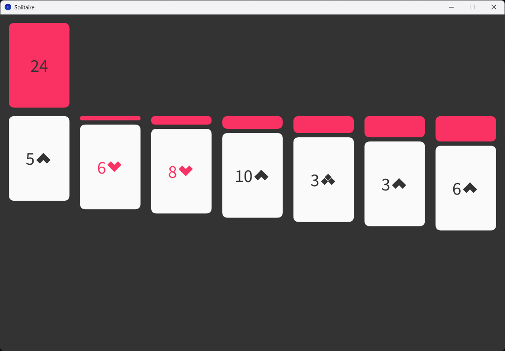

# Solitaire

Welcome to my Solitaire Game! This classic card game has been recreated in Processing, bringing the timeless patience game to your computer. Arrange cards in descending order while alternating colors, and build up foundation piles to win.

## Running the Game

This game is developed in Processing. To run the game:

1. [Download](https://processing.org/download) and install Processing from their official website
2. Open the project folder in Processing
3. Click the "Run" button or press Ctrl+R (Cmd+R on Mac)

## How to Play

Solitaire is a classic single-player card game with simple but strategic gameplay:

1. **Move cards:** Click and drag cards between different card holders (tableau piles, foundation piles, etc.)
2. **Build sequences:** Arrange cards in descending order, alternating between red and black suits
3. **Use the foundation:** Build up foundation piles from Ace to King by suit
4. **Strategic thinking:** Plan your moves carefully to reveal hidden cards and create winning combinations
5. **Win condition:** Successfully move all cards to the foundation piles to complete the game

## Game Features

- Interactive card selection and movement
- Visual highlighting of selected card holders
- Responsive card sizing that adapts to screen dimensions
- Clean, classic solitaire interface

Enjoy this digital recreation of the beloved card game!
